# Despliegue cluster con NodeJS y Express #

- Lo primero que vamos ha hacer es intalar nodejs ya que no esta instalado.

## Proyecto Sin cluster ##

- Hay que crear una carpeta para el proyecto, se inicia con npm init para crear una estructura de carpetas automaticamente.

- Se Hace un npm install expres para instalar el proyecto: 

- Despues de esto creamos con nano un archivo app.js y añadimos el siguiente contenido y se ejecuta node:

- En mi caso, sale un error, que sucede por que la instalacion de node es una version antigua, sale por predeterminado, asi que busco la version mas reciente
- Borrar node.

- Reinstalarlo, con una version mas actual 

- Comprobamos

- Borramos expres por si da fallos

- Ya funcionaria y estaria la aplicacion escuchando por el puerto dicho "3000", para acceder tenemos que saber la ip y poner :3000

## Funcionamiento en Web ##

- Escribimos Hello World:

- Comprobacion Web

- Se puede ver que va lento y cuando abrimos otra pagina vuelve a subir 
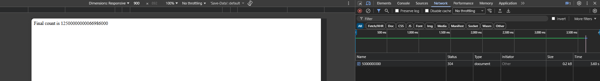
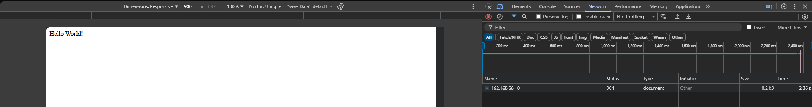
Como se ejecuta como unico proceso, sale asi.

## Proyecto Con cluster ##

- Hay que crear el archivo y se modifica con los siguientes datos: 

- Ejecutamos la app:

- Comprobamos otra vez los tiempos. 

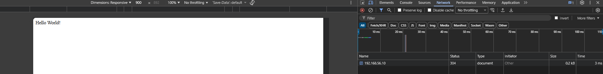
- Esta diferencia es porque se crean varios procesos workers al mismo puerto, entonces las peticiones se distribuyen entre ellos, permitiendo atender a multiples sulicitudes.

## Metricas de rendimiento##

-Instalamos loadtest
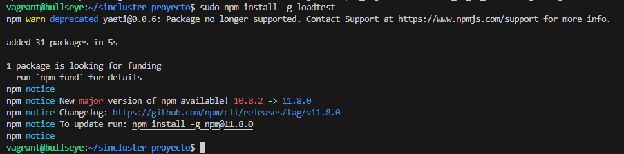
- Comprobamos con "loadtest http://localhost:3000/api/500000 -n 1000 -c 100"
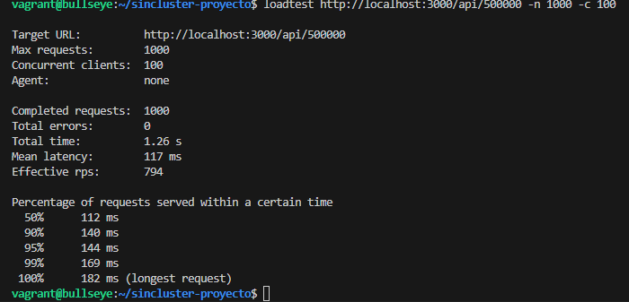
- Ahora lo comprobamos con mas solicitudes "loadtest http://localhost:3000/api/50000000 -n 1000 -c 100"
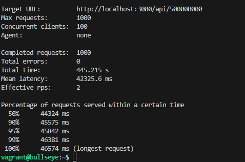

- Ejecutamos la otra aplicacion que si tiene clusters, utilizamos node y comprobamos: 
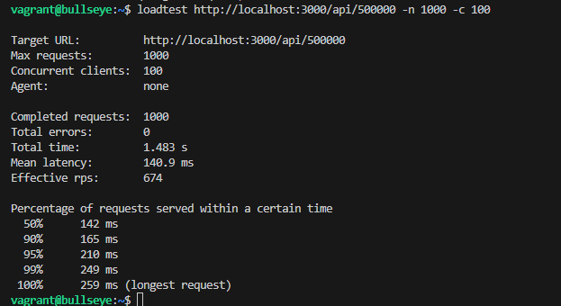
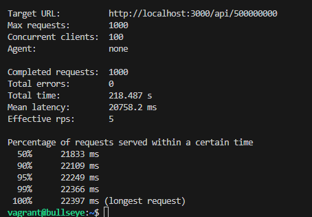

## Uso de PM2 para administrar un clúster de Node.js ##

- Necesitmos instalarnos pm2 y conprobamos
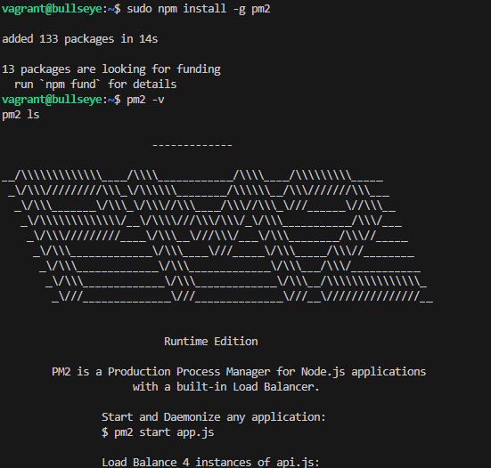
- Iniciamos la aplicaccion sin cluster
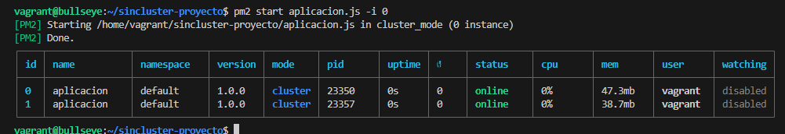

- Nos descargamos  pm2 ecosystme: 
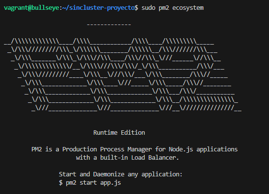
- Se nos crea un archivo "ecosystem.config.js", hay que configurarlo.
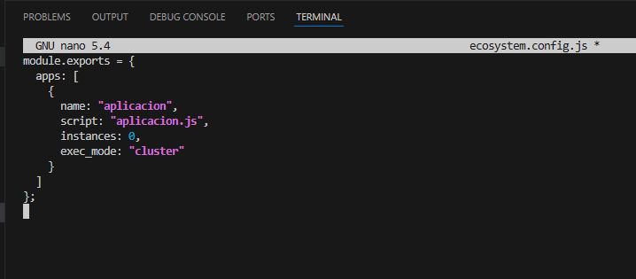
- Iniciamos
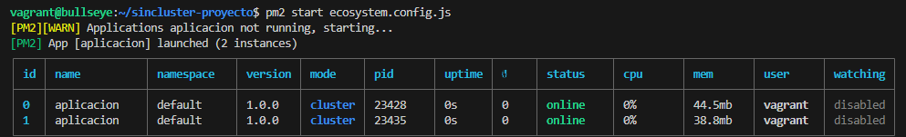
- pm2 ls 
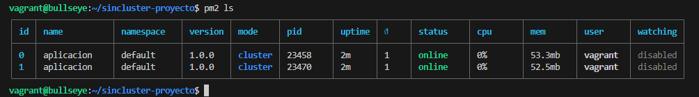
- pm2 log
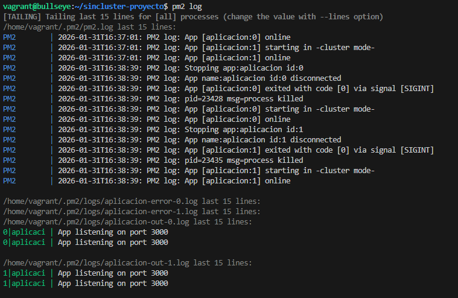
- pm2 monit
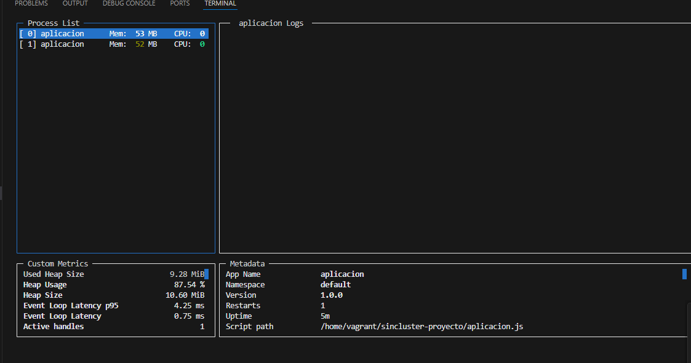

## Cuestionario ##

¿Sabrías decir por qué en algunos casos concretos, como este, la aplicación sin clusterizar tiene
mejores resultados?

La aplicación sin clusterizar es más rápida en tareas ligeras porque evita la sobrecarga de gestión y la latencia de comunicación entre el proceso maestro y los hijos. En sistemas con pocos núcleos, el cambio de contexto constante entre procesos reduce la eficiencia del procesador en lugar de mejorarla. Por tanto, el clustering solo es rentable cuando la complejidad del cálculo compensa el coste de administrar múltiples procesos en paralelo.